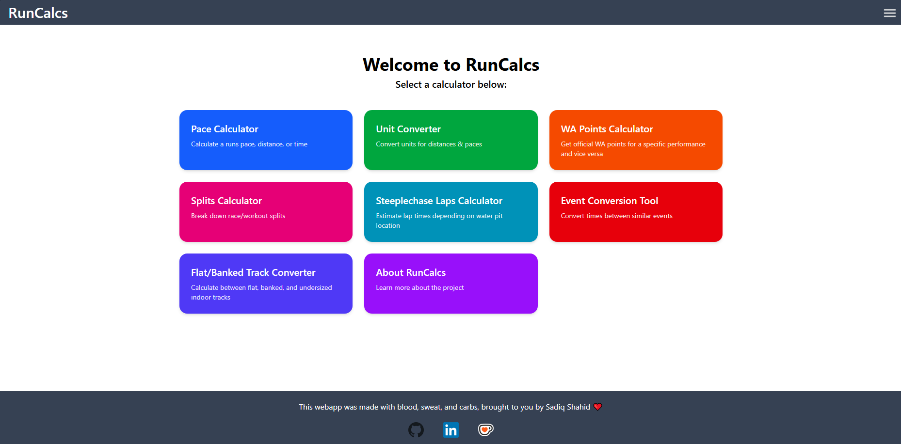
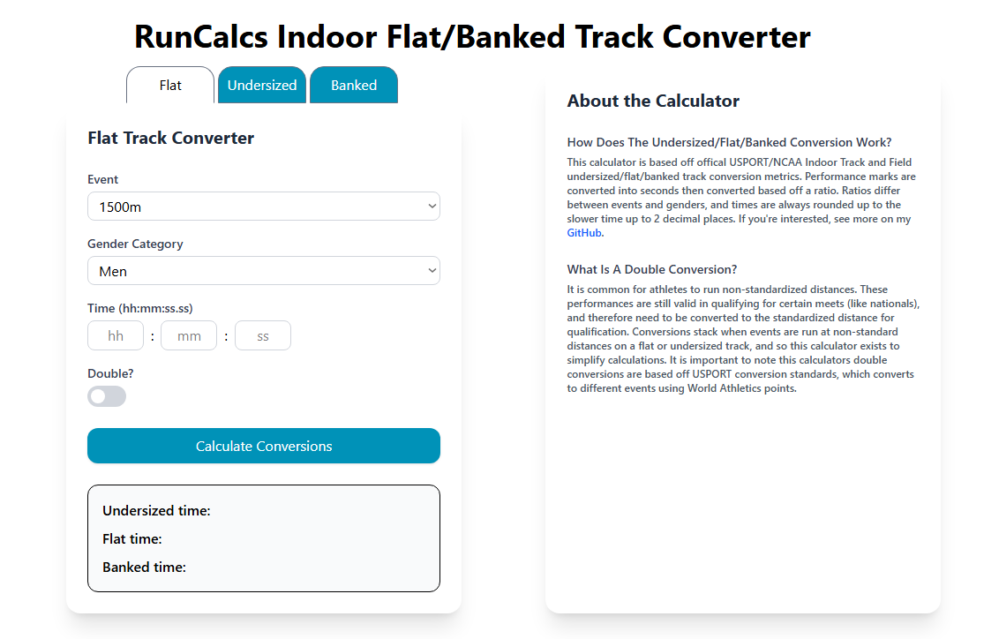
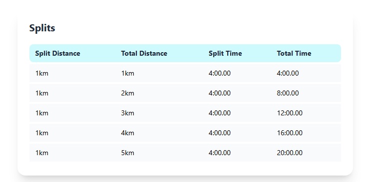

# RunCalcs

RunCalcs is a collection of running-related calculators built to combine my passions for athletics and software development.  
Instead of visiting multiple websites for pace, splits, conversions, and performance metrics, RunCalcs brings them all together in one place.  

🔗 **Live Site:** [RunCalcs](https://runcalcs.ca)  

---

## Features

- **Pace Calculator** – Calculate a runs pace, distance, or time 
- **Unit Converter** – Convert units for distances & paces 
- **WA Points Calculator** – Get official WA points for a specific performance and vice versa 
- **Splits Calculator** – Break down races/workouts into even splits 
- **Steeplechase Laps Calculator** – Estimate lap times depending on water pit location 
- **Event Conversion Tool** – Convert performances between similar events 
- **Flat/Banked Track Converter** – Calculate between flat, banked, and undersized indoor tracks 
- **About Page** – Project details and contact information  

---

## Tech Stack

**Frontend:**  
- React (with Vite)  
- TypeScript  
- TailwindCSS  

**Backend:**  
- Express  
- TypeScript  

**Deployment:**  
- Frontend: Netlify  
- Backend: Render  

---

## Screenshots

---

## About the Project

This project was built as part of my personal portfolio to strengthen my skills in modern web development while tying it to my background as a competitive distance runner.

---

## About Me

My name is Sadiq Shahid.
I’m a Computer Science student at the University of New Brunswick and a cross country + track athlete.
I love blending athletics and technology to create tools that make training and analysis more accessible.

- Email: sadiq.shahid101@gmail.com

- GitHub: [Spherical-S](https://github.com/Spherical-S)

- LinkedIn: [linkedin.com/in/sadiqshahid](linkedin.com/in/sadiqshahid)
